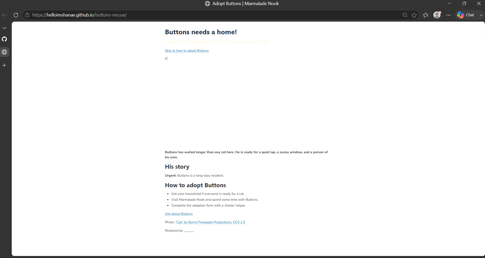
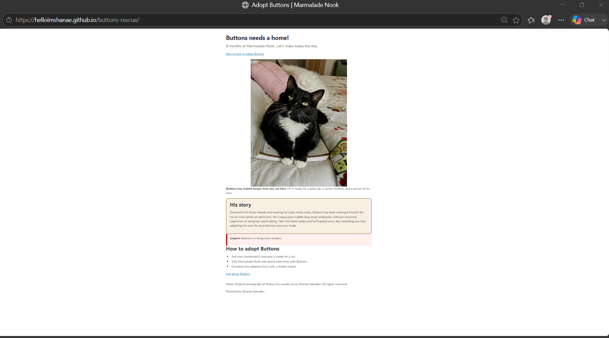

# Buttons' Rescue

This is Buttons' adoption page for Marmalade Nook. When I first received the project, the page had several problems. I created issues for each one and fixed them step by step through my commits.

## Before and after

## What I fixed

- Fixed Buttons' photo so the image loads correctly on the page.
- Corrected the bold formatting so only the intended sentence remains bold.
- Fixed the "Skip to how to adopt Buttons" link so it jumps to the correct section.
- Added a styled box around Buttons' story section to make it stand out.
- Improved the urgent long-stay resident notice so it is easier to notice.
- Changed the tagline color under Buttons' name to improve readability.
- Added text describing the missing photo area.
- Added Buttons' adoption story to help visitors connect with him.
- Included some optional page design elements to give it my personal touch.

## Credits

Photo: Original photograph of Wubzy the tuxedo cat by Shanae Sahadeo. All rights reserved.

Live page: https://helloimshanae.github.io/buttons-rescue/

Restored by Shanae Sahadeo
